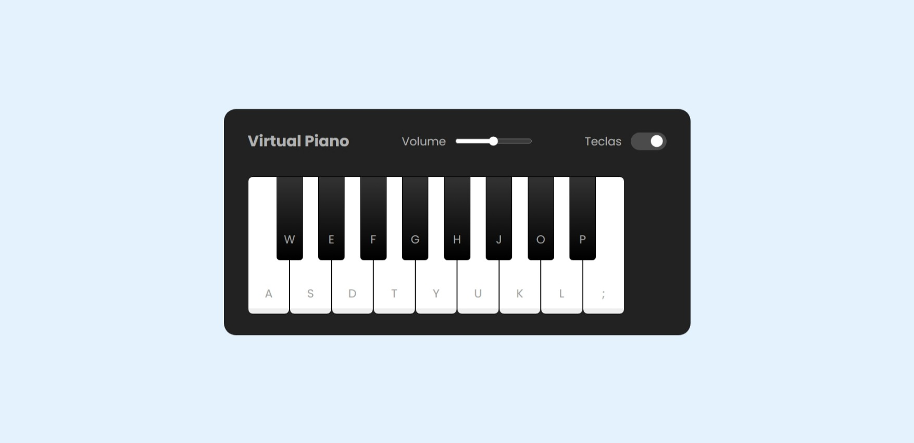

# Virtual Piano

## Descrição

Este é um aplicativo simples de piano desenvolvido em JavaScript. O aplicativo permite que você toque notas musicais clicando nas teclas do piano na interface gráfica ou usando as teclas correspondentes no teclado físico. Além disso, você pode ajustar o volume do piano e ocultar as teclas visíveis na interface.

## Funcionalidades

- **Toque de Teclas:** Clique nas teclas do piano na interface gráfica para tocar notas musicais.
- **Teclas do Teclado:** Use as teclas correspondentes no teclado físico para tocar notas musicais.
- **Controle de Volume:** Ajuste o volume do piano usando o controle deslizante de volume.
- **Ocultar Teclas:** Opte por ocultar as teclas visíveis na interface clicando na opção correspondente.

## Requisitos

Certifique-se de ter os arquivos de áudio das notas musicais localizados em `./src/tunes/`. O aplicativo usa arquivos WAV para cada nota.

## Como Usar

1. Abra o arquivo `index.html` em seu navegador.
2. Interaja com as teclas do piano na interface gráfica ou use as teclas correspondentes no teclado físico.
3. Ajuste o volume usando o controle deslizante de volume.
4. Se preferir, oculte as teclas visíveis clicando na opção apropriada.

## Demonstração

Aproveite e explore suas habilidades musicais no [Virtual Piano](https://virtual-piano-vsalves.vercel.app/), revelando todo o seu talento como a próxima lenda da música.
